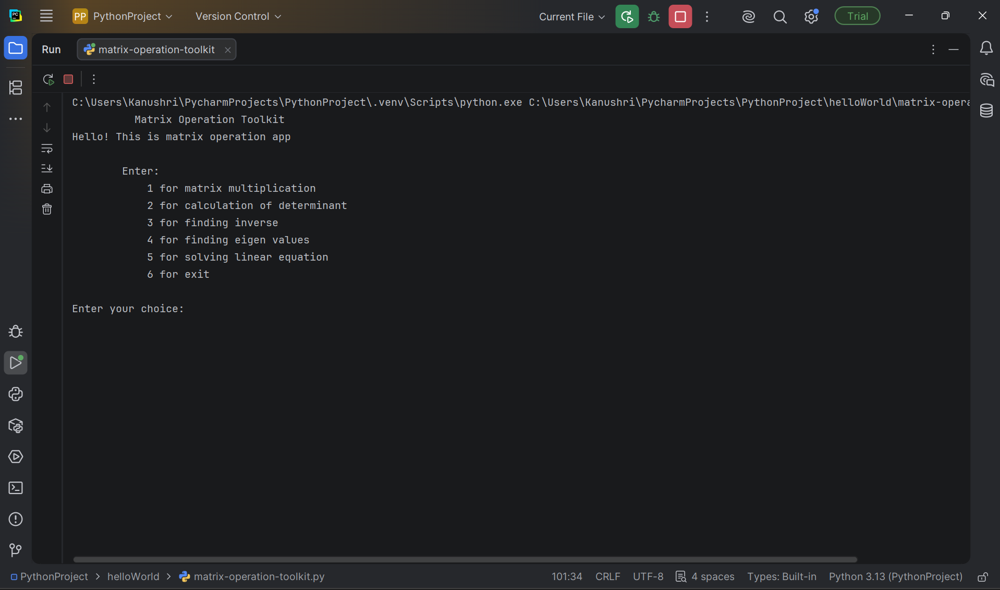
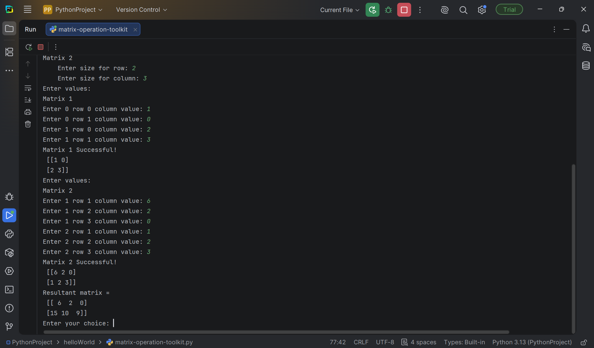
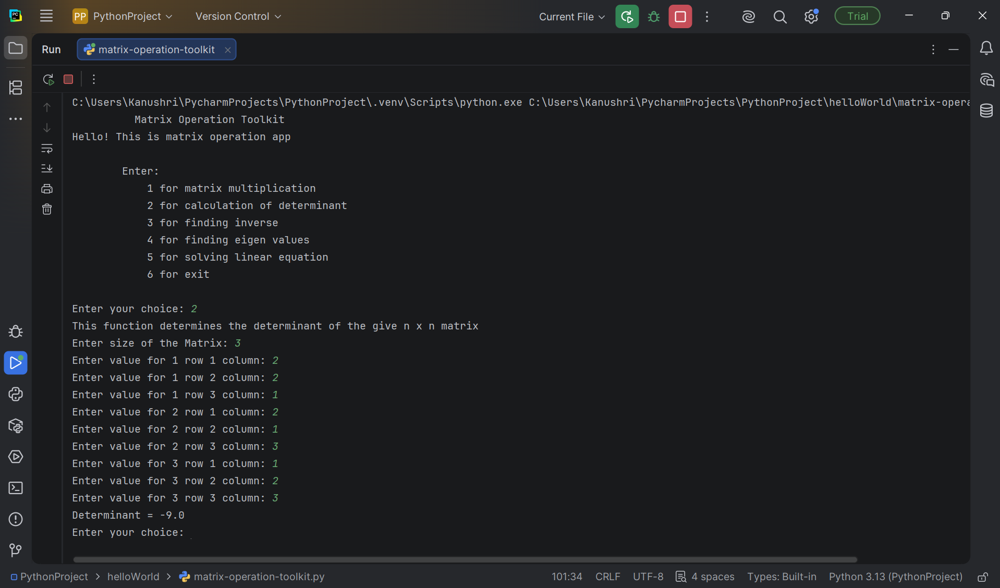

# NumPy Matrix Operation Toolkit

A Python-based matrix calculator built using NumPy.

## Features
- Matrix multiplication
- Determinant calculation
- Matrix inverse
- Eigen value calculation
- Solving linear equations

---

## Main Menu

---

## Matrix Multiplication

---

## Determinant Calculation

